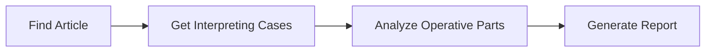
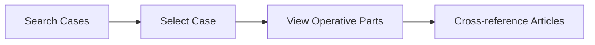
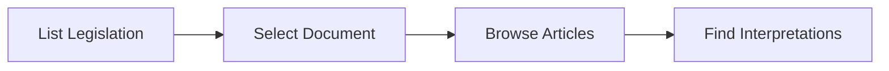

# Lexx EU Legal Research Platform - API Documentation

## Overview

The Lexx API provides comprehensive access to EU legislation, case law, and legal research functionality. The API is **production-ready** with advanced search, caching, authentication, and performance optimizations designed for professional legal research.

## Base URL
```
Production: https://your-domain.com/api
Development: http://localhost:3000/api
```

## 🔐 Authentication & Security

**✅ PRODUCTION-READY AUTHENTICATION**:
- **Supabase Auth** integration with role-based access control
- **User roles**: `lawyer`, `admin`, `readonly` with different permissions
- **Rate limiting** with role-specific quotas (Readonly: 100/min, Lawyer: 500/min, Admin: 1000/min)
- **Request validation** with XSS/SQL injection prevention
- **Input sanitization** and comprehensive security checks

## 🚀 Performance & Caching

**Advanced Caching System**:
- **Memory-based caching** with LRU eviction (Redis-ready architecture)
- **Intelligent cache invalidation** with tag-based cache management
- **Response compression** for faster data transfer
- **Cache durations**: 15-minute legislation cache, 5-minute search cache
- **Performance monitoring** with comprehensive health checks

## Common Response Format

### Success Response Structure
```typescript
// Single resource
{
  "id": "uuid",
  "field1": "value",
  // ... resource fields
}

// Collection with metadata  
{
  "data": [...],
  "pagination": {
    "total": number,
    "limit": number,
    "hasMore": boolean
  },
  "metadata": {
    "timestamp": "ISO-8601",
    "query": "original-query"
  }
}
```

### Error Response Structure
```typescript
{
  "error": "Human-readable error message",
  "code": "ERROR_CODE",
  "details": "Additional error context" // optional
}
```

## API Endpoints

### Legislation Endpoints

| Endpoint | Method | Description |
|----------|--------|-------------|
| `/api/legislations` | GET | List all EU legislation |
| `/api/legislations/{id}` | GET | Get specific legislation |
| `/api/legislations/{id}/articles` | GET | Get articles for legislation |
| `/api/legislations/{id}/cases` | GET | Get cases interpreting legislation |

### Case Law Endpoints

| Endpoint | Method | Description |
|----------|--------|-------------|
| `/api/cases` | GET | List all case law |
| `/api/cases/{id}` | GET | Get specific case with operative parts |

### Article Endpoints

| Endpoint | Method | Description |
|----------|--------|-------------|
| `/api/articles/{id}` | GET | Get specific article |
| `/api/articles/{id}/cases` | GET | Get cases interpreting article |
| `/api/articles/{id}/navigation` | GET | Get navigation context for article |

### Search Endpoints

| Endpoint | Method | Description |
|----------|--------|-------------|
| `/api/search` | GET | Search across all legal content |

### Report Endpoints

| Endpoint | Method | Description |
|----------|--------|-------------|
| `/api/reports/generate` | POST | Generate legal research report |
| `/api/reports/download` | GET | Download generated report |

### Utility Endpoints

| Endpoint | Method | Description |
|----------|--------|-------------|
| `/api/test-db` | GET | Database connectivity test |

## Data Types

### Core Legal Entities

```typescript
// Legislation document
interface Legislation {
  id: string
  celex_number: string        // EU CELEX identifier
  title: string
  publication_date: string | null
  document_type: string | null // "Regulation", "Directive", etc.
  summary: string | null
  source_url: string | null
  full_markdown_content: string | null
  created_at: string
  updated_at: string
}

// Individual article within legislation
interface Article {
  id: string
  legislation_id: string
  article_number: number | null
  article_number_text: string  // "Article 6", "Article 6(1)(a)"
  title: string
  filename: string | null
  markdown_content: string | null
  created_at: string
  updated_at: string
}

// CJEU case law
interface CaseLaw {
  id: string
  celex_number: string        // EU CELEX identifier
  case_id_text: string | null // "C-131/12"
  title: string
  court: string | null        // "Court of Justice", "General Court"
  date_of_judgment: string | null
  parties: string | null
  summary_text: string | null
  html_content: string | null
  plaintext_content: string | null
  html_content_link: string | null
  plaintext_content_link: string | null
  source_url: string | null
  operative_parts_combined: string | null
  operative_parts_individual: any | null
  created_at: string
  updated_at: string
}

// Individual ruling within a case
interface OperativePart {
  id: string
  case_law_id: string
  part_number: number
  verbatim_text: string | null      // Original court language
  simplified_text: string | null    // Simplified for readability
  markdown_content: string | null
  created_at: string
  updated_at: string
}
```

## Error Codes

| Code | Description | HTTP Status |
|------|-------------|-------------|
| `VALIDATION_ERROR` | Request validation failed | 400 |
| `NOT_FOUND` | Resource not found | 404 |
| `DATABASE_ERROR` | Database connection/query error | 500 |
| `INTERNAL_ERROR` | Unexpected server error | 500 |

## Legal Research Workflows

### 1. Article-to-Case Research


### 2. Case Law Analysis


### 3. Legislation Overview


## Performance Notes

- **Database**: PostgreSQL with Supabase
- **Caching**: No caching currently implemented ⚠️
- **Rate Limiting**: No rate limiting currently implemented ⚠️
- **Pagination**: Implemented where applicable

## Security Considerations

⚠️ **SECURITY NOTES - PLACEHOLDERS/HARDCODED CONTENT**:

1. **No Authentication**: Currently no authentication is implemented
2. **No Rate Limiting**: API is open to abuse
3. **No Input Sanitization**: SQL injection protection relies on Supabase
4. **CORS**: May need configuration for production
5. **Environment Variables**: Ensure proper configuration in production

## Development Notes

### Hardcoded/Placeholder Content

1. **Error Messages**: Some error messages are generic
2. **Search Scoring**: Basic relevance scoring algorithm
3. **Report Generation**: Limited template options
4. **Database Test**: Uses placeholder connection testing

### Missing Features

1. **Authentication & Authorization**
2. **Comprehensive Logging**
3. **Request Validation**
4. **Rate Limiting**
5. **Caching Strategy**
6. **API Versioning**
7. **OpenAPI/Swagger Documentation**

## Testing

### Test Database Endpoint
```bash
curl http://localhost:3000/api/test-db
```

Expected response:
```json
{
  "connection": "SUCCESS",
  "timestamp": "2024-01-20T15:45:00Z",
  "tables": {
    "legislations": { "count": 100, "accessible": true },
    "case_laws": { "count": 250, "accessible": true },
    "articles": { "count": 1500, "accessible": true }
  }
}
```

## Next Steps for Production

1. **Implement Authentication System**
2. **Add Request Validation Layer**
3. **Implement Rate Limiting**
4. **Add Comprehensive Logging**
5. **Set up Error Monitoring**
6. **Add API Versioning**
7. **Implement Caching Strategy**
8. **Add OpenAPI Documentation**
9. **Security Audit**
10. **Performance Testing**

---

*API Documentation Version: 1.0*  
*Last Updated: July 21, 2025*  
*Status: Development - Not Production Ready*