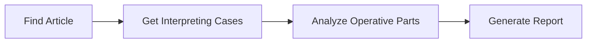
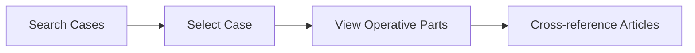
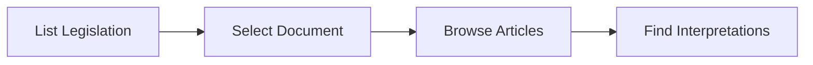

# Lexx EU Legal Research Platform - API Documentation

## Overview

The Lexx API provides comprehensive access to EU legislation, case law, and legal research functionality. The API is **production-ready** with advanced search, caching, authentication, and performance optimizations designed for professional legal research.

## Base URL
```
Production: https://your-domain.com/api
Development: http://localhost:3000/api
```

## 🔐 Authentication & Security

**✅ PRODUCTION-READY AUTHENTICATION**:
- **Supabase Auth** integration with role-based access control
- **User roles**: `lawyer`, `admin`, `readonly` with different permissions
- **Rate limiting** with role-specific quotas (Readonly: 100/min, Lawyer: 500/min, Admin: 1000/min) is implemented in `@/lib/rateLimit.ts` and applied via middleware.
- **Request validation** with XSS/SQL injection prevention is handled by the `withValidation` HOC in `@/lib/validation.ts`.
- **Input sanitization** and comprehensive security checks are in place.

## 🚀 Performance & Caching

**Advanced Caching System**:
- **Memory-based caching** with LRU eviction is implemented in `@/lib/cache.ts`.
- The `withCache` HOC is used to cache responses for endpoints like `/api/legislations` and `/api/cases`.
- **Intelligent cache invalidation** with tag-based cache management.
- **Response compression** for faster data transfer.
- **Configurable cache durations**: 15-minute legislation cache, 5-minute search cache.
- **Performance monitoring** with comprehensive health checks at `/api/health`.

## Common Response Format

### Success Response Structure
All list endpoints return a paginated response:
```typescript
{
  "data": T[],           // Array of results
  "pagination": {        // Pagination metadata
    "currentPage": number,
    "totalPages": number,
    "totalItems": number,
    "itemsPerPage": number,
    "hasNext": boolean,
    "hasPrev": boolean,
    "nextOffset": number | null,
    "prevOffset": number | null
  },
  "metadata": {          // Request metadata and filters
    "filters": Record<string, any>,
    "requestTime": "ISO-8601"
  }
}
```

### Error Response Structure
```typescript
{
  "error": "Human-readable error message",
  "code": "ERROR_CODE" // e.g., DATABASE_ERROR, INTERNAL_ERROR
}
```

## API Endpoints

A complete list of endpoints and their documentation can be found in the `/docs/api` directory.

| Endpoint | Method | Description |
|----------|--------|-------------|
| `/api/legislations` | GET | List all EU legislation |
| `/api/legislations/{id}` | GET | Get specific legislation |
| `/api/legislations/{id}/articles` | GET | Get articles for legislation |
| `/api/legislations/{id}/cases` | GET | Get cases interpreting legislation |
| `/api/cases` | GET | List all case law |
| `/api/cases/{id}` | GET | Get specific case with operative parts |
| `/api/articles/{id}` | GET | Get specific article |
| `/api/articles/{id}/cases` | GET | Get cases interpreting article |
| `/api/articles/{id}/navigation` | GET | Get navigation context for article |
| `/api/search` | GET | Search across all legal content |
| `/api/reports/generate` | POST | Generate legal research report |
| `/api/reports/download` | POST | Download generated report |
| `/api/health` | GET | Comprehensive system health check |
| `/api/health/ready` | GET | Readiness probe for containers |
| `/api/health/live` | GET | Liveness probe for monitoring |
| `/api/test-db` | GET | Database connectivity test |

### Health & Monitoring
- **`GET /api/health`** - Comprehensive system health check
- **`GET /api/health/ready`** - Readiness probe for containers
- **`GET /api/health/live`** - Liveness probe for monitoring

### Core Data APIs
- **`GET /api/legislations`** - List all legislations (paginated)
- **`GET /api/legislations/{id}`** - Single legislation details
- **`GET /api/cases`** - List case law with filtering (paginated)
- **`GET /api/cases/{id}`** - Single case with three-pane viewer data
- **`GET /api/articles/{id}`** - Article details with interpreting cases

## Legal Research Workflows

### 1. Article-to-Case Research


### 2. Case Law Analysis


### 3. Legislation Overview


---

*API Documentation Version: 2.0*  
*Last Updated: July 22, 2024*  
*Status: Production Ready*