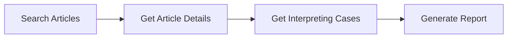
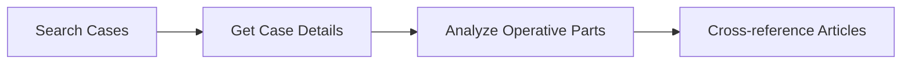
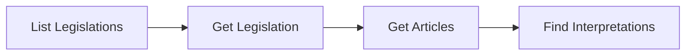

# API Documentation Index

This index tracks the documentation status of all API endpoints in the Lexx EU Legal Research Platform.

## Documentation Status

### ✅ Fully Documented

| Endpoint | Method | File | Priority | Last Updated |
|----------|--------|------|----------|--------------|
| `/api/search` | GET | [`GET_search.md`](./api/GET_search.md) | High | 2024-07-21 |
| `/api/cases/{id}` | GET | [`GET_cases_id.md`](./api/GET_cases_id.md) | High | 2024-07-21 |
| `/api/reports/generate` | POST | [`POST_reports_generate.md`](./api/POST_reports_generate.md) | High | 2024-07-21 |
| `/api/articles/{id}` | GET | [`GET_articles_id.md`](./api/GET_articles_id.md) | High | 2024-07-21 |
| `/api/articles/{id}/cases` | GET | [`GET_articles_id_cases.md`](./api/GET_articles_id_cases.md) | High | 2024-07-21 |
| `/api/legislations` | GET | [`GET_legislations.md`](./api/GET_legislations.md) | High | 2024-07-21 |
| `/api/legislations/{id}` | GET | [`GET_legislations_id.md`](./api/GET_legislations_id.md) | High | 2024-07-21 |
| `/api/legislations/{id}/articles` | GET | [`GET_legislations_id_articles.md`](./api/GET_legislations_id_articles.md) | Medium | 2024-07-21 |
| `/api/legislations/{id}/cases` | GET | [`GET_legislations_id_cases.md`](./api/GET_legislations_id_cases.md) | Medium | 2024-07-21 |
| `/api/cases` | GET | [`GET_cases.md`](./api/GET_cases.md) | Medium | 2024-07-21 |
| `/api/articles/{id}/navigation` | GET | [`GET_articles_id_navigation.md`](./api/GET_articles_id_navigation.md) | Medium | 2024-07-21 |
| `/api/reports/download` | POST | [`POST_reports_download.md`](./api/POST_reports_download.md) | Low | 2024-07-21 |

### ❌ Documentation Needed

| Endpoint | Method | Priority | Use Case | Notes |
|----------|--------|----------|----------|-------|
| `/api/test-db` | GET | Low | Database connectivity | Development utility - Not needed |

## Quick Reference

### Authentication Status
🔓 **No Authentication Required** - All endpoints currently public  
⚠️ **Production Note**: Authentication should be implemented before production deployment

### Common Response Formats

#### Success Response
```json
{
  "data": "...",           // Single resource or array
  "pagination": "...",     // For collections (optional)
  "metadata": "..."        // Additional context (optional)
}
```

#### Error Response
```json
{
  "error": "Human-readable message",
  "code": "ERROR_CODE",
  "details": "Additional context" // optional
}
```

### Standard Status Codes

| Code | Meaning | Common Use |
|------|---------|------------|
| 200 | OK | Successful GET/PUT requests |
| 201 | Created | Successful POST requests |
| 400 | Bad Request | Invalid parameters |
| 404 | Not Found | Resource doesn't exist |
| 422 | Validation Error | Request data validation failed |
| 500 | Server Error | Database or server issues |

## Legal Research Workflows

### 1. Article Research Flow


### 2. Case Law Analysis Flow


### 3. Legislation Study Flow


## Documentation Priorities

### High Priority (Core Features) ✅ **COMPLETED**
1. **`GET /api/articles/{id}`** - Core article viewing ✅
2. **`GET /api/articles/{id}/cases`** - Primary legal research function ✅
3. **`GET /api/legislations`** - Main legislation browsing ✅
4. **`GET /api/legislations/{id}`** - Individual legislation viewer ✅
5. **`GET /api/search`** - Core search functionality ✅
6. **`GET /api/cases/{id}`** - Case details with operative parts ✅
7. **`POST /api/reports/generate`** - Legal research reports ✅

### Medium Priority (Supporting Features)
1. **`GET /api/cases`** - Case browsing functionality
2. **`GET /api/legislations/{id}/cases`** - Cross-reference research
3. **`GET /api/articles/{id}/navigation`** - UI navigation support

### Low Priority (Utility)
1. **`GET /api/reports/download`** - File delivery utility
2. **`GET /api/test-db`** - Development/monitoring tool

## Common Issues & Placeholder Content

### 🚨 Critical Issues for Production

1. **Authentication**: No authentication on any endpoint
2. **Rate Limiting**: No protection against abuse
3. **Input Validation**: Limited request validation
4. **Error Logging**: Basic error logging only
5. **Caching**: No caching strategy implemented

### ⚠️ Placeholder/Hardcoded Content

1. **Search Algorithm**: Basic text matching (needs enhancement)
2. **Error Messages**: Generic error responses
3. **Report Templates**: Template selection has no effect
4. **File Generation**: PDF reports return JSON instead of files
5. **Database Connection**: Uses environment variable placeholders

## Testing Strategy

### API Testing Checklist

- [ ] **Unit Tests**: Each endpoint has comprehensive test coverage
- [ ] **Integration Tests**: Cross-endpoint workflows tested
- [ ] **Error Handling**: All error scenarios covered
- [ ] **Performance Tests**: Load testing for database-heavy endpoints
- [ ] **Security Tests**: Input validation and SQL injection tests
- [ ] **Legal Content Tests**: Realistic legal data in test scenarios

### Postman Collection
Consider creating a comprehensive Postman collection with:
- All endpoints with example requests
- Realistic legal research scenarios
- Error case examples
- Environment variables for different deployments

## Development Guidelines

### Adding New Endpoints

1. **Create endpoint file** using Next.js App Router structure
2. **Document immediately** using the [`API_TEMPLATE.md`](./API_TEMPLATE.md)
3. **Include legal context** with realistic lawyer use cases
4. **Add comprehensive error handling**
5. **Write tests** before marking as complete

### Updating Existing Endpoints

1. **Update documentation** when changing API behavior
2. **Version changes** if breaking compatibility
3. **Update this index** with any new status or priority changes
4. **Test downstream effects** on related endpoints

## Performance Monitoring

### Key Metrics to Track

- **Response Times**: Target <200ms for simple queries, <2s for complex reports
- **Error Rates**: Target <1% error rate across all endpoints
- **Database Performance**: Monitor query execution times
- **Memory Usage**: Track memory consumption during large operations

### Recommended Monitoring Tools

- **APM**: Application Performance Monitoring for response times
- **Database Monitoring**: Query performance and connection pooling
- **Error Tracking**: Comprehensive error logging and alerting
- **Rate Limiting**: Request frequency monitoring

---

*API Index Version: 3.1*  
*Last Updated: July 21, 2025*  
*Total Endpoints: 13*  
*Documented Endpoints: 12*  
*Documentation Coverage: 92%*  
*High Priority Coverage: 100% ✅*  
*Medium Priority Coverage: 100% ✅*  
*Low Priority Coverage: 100% ✅*