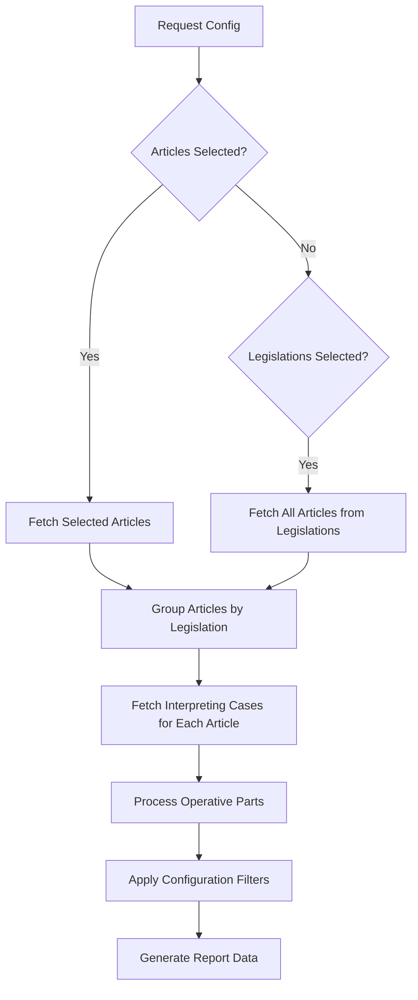

# Report Generation API - POST /api/reports/generate

## Endpoint Information
- **Path**: `/api/reports/generate`
- **Method**: `POST`
- **Description**: Generate comprehensive legal research reports based on selected legislation, articles, and case law interpretations
- **Version**: `v1.0`
- **Last Updated**: `2024-07-21`

## Authentication
- **Required**: `No` ⚠️ *Should be implemented for production*
- **Type**: `None`
- **Scope**: `write`

## Request

### Request Body
```typescript
interface ReportConfig {
  title: string
  description?: string
  legislations: string[]              // Legislation UUIDs
  articles: string[]                  // Article UUIDs
  includeOperativeParts: boolean
  operativePartsMode: 'verbatim' | 'simplified'
  includeArticleText: boolean
  includeCaseSummaries: boolean
  format: 'html' | 'pdf'
  template: 'standard' | 'detailed' | 'summary'
}
```

### Request Examples

#### Standard Legal Research Report
```bash
curl -X POST "http://localhost:3000/api/reports/generate" \
  -H "Content-Type: application/json" \
  -H "Accept: application/json" \
  -d '{
    "title": "GDPR Compliance Analysis",
    "description": "Analysis of key GDPR articles and their interpretation by the CJEU",
    "legislations": ["uuid-gdpr-123"],
    "articles": ["uuid-article-6", "uuid-article-7", "uuid-article-17"],
    "includeOperativeParts": true,
    "operativePartsMode": "simplified",
    "includeArticleText": true,
    "includeCaseSummaries": true,
    "format": "html",
    "template": "detailed"
  }'
```

#### Article-Specific Report
```bash
curl -X POST "http://localhost:3000/api/reports/generate" \
  -H "Content-Type: application/json" \
  -d '{
    "title": "Right to be Forgotten Case Law",
    "legislations": [],
    "articles": ["uuid-article-17-gdpr"],
    "includeOperativeParts": true,
    "operativePartsMode": "verbatim",
    "includeArticleText": false,
    "includeCaseSummaries": false,
    "format": "pdf",
    "template": "summary"
  }'
```

#### Comprehensive Legislation Report
```javascript
// JavaScript example
const reportConfig = {
  title: "Digital Services Act Overview",
  description: "Complete analysis of DSA provisions and early case law",
  legislations: ["uuid-dsa-456", "uuid-dmca-789"],
  articles: [], // Include all articles from specified legislation
  includeOperativeParts: true,
  operativePartsMode: "simplified",
  includeArticleText: true,
  includeCaseSummaries: true,
  format: "html",
  template: "standard"
}

const response = await fetch('/api/reports/generate', {
  method: 'POST',
  headers: { 'Content-Type': 'application/json' },
  body: JSON.stringify(reportConfig)
})
```

## Response

### Success Response (200)
```typescript
interface ReportData {
  config: ReportConfig
  content: {
    legislations: LegislationReportData[]
    generatedAt: string
    totalArticles: number
    totalCases: number
  }
}

interface LegislationReportData extends Legislation {
  articles: ArticleReportData[]
}

interface ArticleReportData extends Article {
  legislation: Legislation
  cases: CaseReportData[]
}

interface CaseReportData extends CaseLaw {
  operative_parts: OperativePartReportData[]
}

interface OperativePartReportData extends OperativePart {
  articles: Article[]
}
```

### Response Example

#### Generated Report Data
```json
{
  "config": {
    "title": "GDPR Compliance Analysis",
    "description": "Analysis of key GDPR articles and their interpretation by the CJEU",
    "legislations": ["uuid-gdpr-123"],
    "articles": ["uuid-article-6", "uuid-article-17"],
    "includeOperativeParts": true,
    "operativePartsMode": "simplified",
    "includeArticleText": true,
    "includeCaseSummaries": true,
    "format": "html",
    "template": "detailed"
  },
  "content": {
    "legislations": [
      {
        "id": "uuid-gdpr-123",
        "celex_number": "32016R0679",
        "title": "General Data Protection Regulation",
        "publication_date": "2016-05-04",
        "document_type": "Regulation",
        "summary": "Regulation on the protection of natural persons...",
        "source_url": "https://eur-lex.europa.eu/eli/reg/2016/679/oj",
        "created_at": "2024-01-10T09:00:00Z",
        "updated_at": "2024-01-10T09:00:00Z",
        "articles": [
          {
            "id": "uuid-article-6",
            "legislation_id": "uuid-gdpr-123",
            "article_number": 6,
            "article_number_text": "Article 6",
            "title": "Lawfulness of processing",
            "markdown_content": "1. Processing shall be lawful only if and to the extent that at least one of the following applies...",
            "created_at": "2024-01-10T09:15:00Z",
            "updated_at": "2024-01-10T09:15:00Z",
            "legislation": {
              "id": "uuid-gdpr-123",
              "title": "General Data Protection Regulation",
              "celex_number": "32016R0679"
            },
            "cases": [
              {
                "id": "uuid-case-456",
                "celex_number": "62019CJ0645",
                "case_id_text": "C-645/19",
                "title": "Facebook Ireland and Others",
                "court": "Court of Justice",
                "date_of_judgment": "2021-06-04",
                "parties": "Facebook Ireland Limited, Facebook Inc., Maximillian Schrems",
                "summary_text": "The Court ruled on the adequacy of safeguards for data transfers...",
                "created_at": "2024-01-15T14:30:00Z",
                "updated_at": "2024-01-15T14:30:00Z",
                "operative_parts": [
                  {
                    "id": "uuid-op-789",
                    "case_law_id": "uuid-case-456",
                    "part_number": 1,
                    "verbatim_text": "National supervisory authorities have the power to suspend data flows to third countries...",
                    "simplified_text": "National authorities can suspend data transfers to third countries.",
                    "created_at": "2024-01-15T14:30:00Z",
                    "updated_at": "2024-01-15T14:30:00Z",
                    "articles": [
                      {
                        "id": "uuid-article-6",
                        "article_number_text": "Article 6",
                        "title": "Lawfulness of processing"
                      }
                    ]
                  }
                ]
              }
            ]
          }
        ]
      }
    ],
    "generatedAt": "2024-07-21T10:30:00Z",
    "totalArticles": 2,
    "totalCases": 5
  }
}
```

#### Empty Report (No Content Found)
```json
{
  "config": {
    "title": "Empty Report Test",
    "legislations": [],
    "articles": []
  },
  "content": {
    "legislations": [],
    "generatedAt": "2024-07-21T10:30:00Z",
    "totalArticles": 0,
    "totalCases": 0
  }
}
```

## Error Responses

### 400 - Bad Request (No Content Selected)
```json
{
  "error": "At least one legislation or article must be selected",
  "code": "VALIDATION_ERROR"
}
```

**When this occurs**: Both `legislations` and `articles` arrays are empty

### 400 - Bad Request (Invalid Configuration)
```json
{
  "error": "Invalid report configuration",
  "details": "operativePartsMode must be 'verbatim' or 'simplified'",
  "code": "VALIDATION_ERROR"
}
```

**When this occurs**: Invalid values in the ReportConfig object

### 422 - Validation Error
```json
{
  "error": "Validation failed",
  "details": [
    {
      "field": "title",
      "message": "Title is required and must be at least 3 characters"
    },
    {
      "field": "format",
      "message": "Format must be 'html' or 'pdf'"
    }
  ],
  "code": "VALIDATION_ERROR"
}
```

**When this occurs**: Request body validation fails

### 500 - Database Error
```json
{
  "error": "Failed to fetch articles",
  "code": "DATABASE_ERROR"
}
```

**When this occurs**: Database queries fail during report generation

### 500 - Internal Server Error
```json
{
  "error": "Internal server error",
  "code": "INTERNAL_ERROR"
}
```

**When this occurs**: Unexpected errors during report processing

## Status Codes

| Code | Meaning | When Used |
|------|---------|-----------|
| 200 | OK | Report generated successfully |
| 400 | Bad Request | Invalid request configuration |
| 422 | Validation Error | Request body validation failed |
| 500 | Server Error | Database or processing error |

## Report Generation Process

### Data Collection Pipeline


### Configuration Options Impact

| Option | Effect on Output |
|--------|------------------|
| `includeOperativeParts: true` | Includes full operative part text |
| `operativePartsMode: "simplified"` | Shows simplified instead of verbatim text |
| `includeArticleText: true` | Includes full article markdown content |
| `includeCaseSummaries: true` | Includes case summary_text field |
| `template: "detailed"` | Affects data structure (future enhancement) |
| `format: "pdf"` | Affects response format (future enhancement) |

⚠️ **PLACEHOLDER NOTES**:
- PDF format not yet implemented (returns same as HTML)
- Template variations not yet implemented
- No actual file generation, returns structured data

## Performance Considerations

- **Complex Queries**: Multiple database queries per article
- **Data Volume**: Large reports with many articles/cases can be slow
- **Processing Time**: JavaScript processing of nested data structures
- **Memory Usage**: Entire report held in memory during generation

⚠️ **Performance Issues**:
- No background processing for large reports
- No progress tracking for long-running reports
- No result caching
- No query optimization

## Legal Research Context

### Use Cases

1. **Case Law Analysis Report**
   ```javascript
   // Generating report for specific legal research
   const config = {
     title: "Data Protection Impact Assessment Requirements",
     articles: ["uuid-article-35-gdpr"], // GDPR Article 35
     includeOperativeParts: true,
     operativePartsMode: "simplified",
     template: "detailed"
   }
   ```

2. **Legislation Overview Report**
   ```javascript
   // Comprehensive overview of new legislation
   const config = {
     title: "Digital Services Act - Complete Analysis",
     legislations: ["uuid-dsa-123"],
     articles: [], // All articles
     includeArticleText: true,
     includeCaseSummaries: false, // No cases yet for new legislation
     template: "standard"
   }
   ```

3. **Cross-Legislative Comparison**
   ```javascript
   // Comparing similar provisions across different laws
   const config = {
     title: "Privacy Rights Across EU Law",
     legislations: ["uuid-gdpr-123", "uuid-charter-456"],
     articles: ["uuid-art-7-charter", "uuid-art-8-charter", "uuid-art-6-gdpr"],
     includeOperativeParts: true,
     template: "summary"
   }
   ```

4. **Court Decision Analysis**
   ```javascript
   // Analyzing judicial interpretation patterns
   const config = {
     title: "CJEU Interpretation of Consent Requirements",
     articles: ["uuid-article-6-gdpr", "uuid-article-7-gdpr"],
     includeOperativeParts: true,
     operativePartsMode: "verbatim", // Exact court language
     includeCaseSummaries: true
   }
   ```

### Report Structure
Reports follow EU legal hierarchy:
1. **Legislation Level**: Primary law sources
2. **Article Level**: Specific legal provisions
3. **Case Law Level**: Judicial interpretations
4. **Operative Parts**: Specific court rulings

## Security Considerations

⚠️ **SECURITY PLACEHOLDER NOTES**:

1. **No Authentication**: Anyone can generate reports
2. **No Rate Limiting**: Expensive report generation can be abused
3. **Data Exposure**: All legal content accessible without permission controls
4. **Resource Usage**: Large reports consume significant server resources
5. **Input Validation**: Limited validation of report configuration

## Caching & Storage

⚠️ **NOT CURRENTLY IMPLEMENTED**:

```javascript
// Recommended report caching
const cacheStrategy = {
  key: `report:${hash(config)}`,
  duration: '24 hours',
  invalidation: 'on_legal_content_update',
  storage: 'redis_cluster'
}

// File storage for generated reports
const fileStorage = {
  location: 's3_bucket',
  retention: '30 days',
  access: 'authenticated_users_only'
}
```

## Testing

### Unit Tests
```typescript
describe('POST /api/reports/generate', () => {
  it('should generate report with selected articles', async () => {
    const config = {
      title: "Test Report",
      articles: ["valid-article-uuid"],
      legislations: [],
      includeOperativeParts: true,
      operativePartsMode: "simplified",
      includeArticleText: true,
      includeCaseSummaries: false,
      format: "html",
      template: "standard"
    }

    const response = await request(app)
      .post('/api/reports/generate')
      .send(config)
      .expect(200)
    
    expect(response.body.config.title).toBe("Test Report")
    expect(response.body.content.totalArticles).toBeGreaterThan(0)
  })

  it('should reject empty configuration', async () => {
    const config = {
      title: "Empty Report",
      articles: [],
      legislations: []
    }

    await request(app)
      .post('/api/reports/generate')
      .send(config)
      .expect(400)
  })

  it('should handle non-existent article IDs gracefully', async () => {
    const config = {
      title: "Invalid Articles Test",
      articles: ["non-existent-uuid"],
      legislations: []
    }

    const response = await request(app)
      .post('/api/reports/generate')
      .send(config)
      .expect(200)
    
    expect(response.body.content.totalArticles).toBe(0)
  })
})
```

### Integration Tests
- Test with various legislation/article combinations
- Verify case law fetching and processing
- Test performance with large report configurations
- Validate data consistency across related endpoints

## Known Issues & Limitations

⚠️ **CURRENT LIMITATIONS**:

1. **No Async Processing**: Large reports block the request
2. **Memory Constraints**: Entire report processed in memory
3. **No File Generation**: Only returns JSON data, not actual PDF/HTML files
4. **Limited Templates**: Template selection has no effect
5. **No Progress Tracking**: No way to monitor report generation progress
6. **Duplicate Data**: Same data may appear in multiple report sections
7. **No Export Options**: No actual file download capability

## Future Enhancements

### Planned Features ⚠️ **NOT IMPLEMENTED**:

1. **Background Processing**
   ```javascript
   // Async report generation
   POST /api/reports/generate -> { job_id: "uuid", status: "processing" }
   GET /api/reports/status/{job_id} -> { status: "completed", download_url: "..." }
   ```

2. **File Generation**
   ```javascript
   // Actual file output
   const pdfBuffer = await generatePDF(reportData)
   const downloadUrl = await uploadToS3(pdfBuffer)
   ```

3. **Template System**
   ```javascript
   // Template variations
   const templates = {
     'standard': 'executive-summary-format',
     'detailed': 'comprehensive-analysis-format', 
     'summary': 'key-points-only-format'
   }
   ```

## Changelog

### v1.0.0 (Current)
- Basic report generation with article and case law inclusion
- Configuration options for operative parts and case summaries
- Error handling for invalid configurations
- Data aggregation and processing pipeline

---

*Endpoint: `/src/app/api/reports/generate/route.ts`*  
*Last Updated: July 21, 2025*  
*Status: Development - Core Functionality Complete, Needs Production Features*